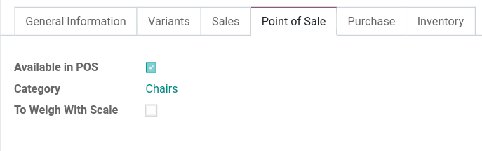
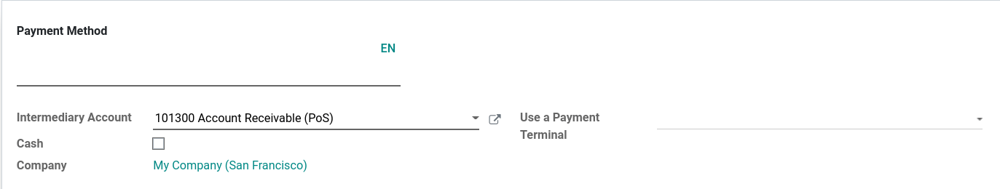
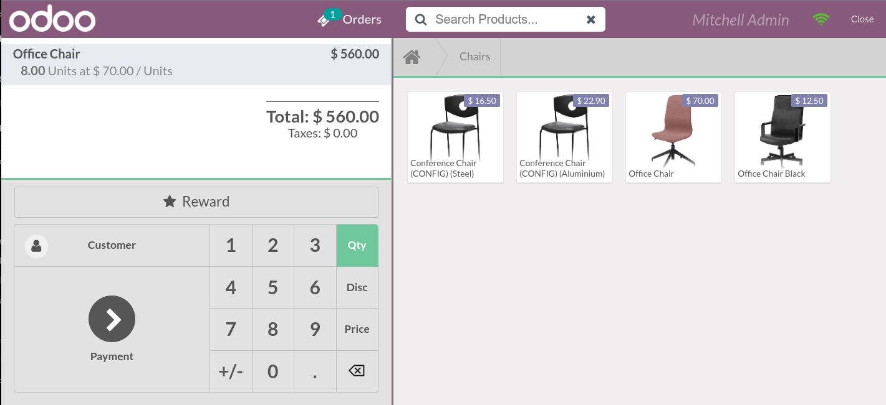
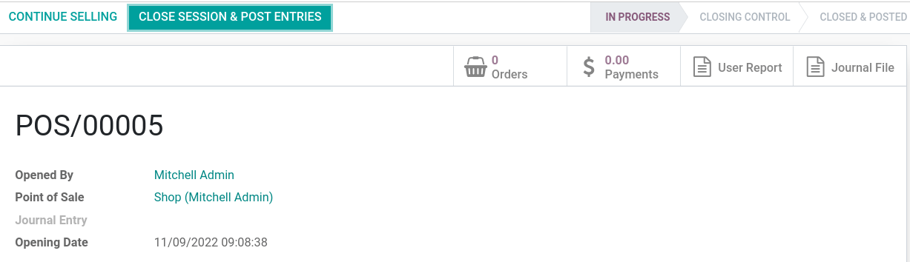

===============
Getting started
===============

**Point of Sale** offers employees a simple and user-friendly solution that works online or offline
with any device.

A point of sale system is a fully integrated application that allows any transaction, automatically
registers product moves in your stock, and gives you real-time statistics and consolidations across
all shops.

Configuration
=============

Make products available
-----------------------

To make products available for sale, go to :menuselection:`Products --> Products`, and open a
product. In the :guilabel:`Point of Sale` tab, enable :guilabel:`Available in POS`.

Configure your payment methods
------------------------------

To add a payment method, you first need to create it. Go to :menuselection:`Configuration -->
Payment Methods -->Create`. Name your payment method and select the **payment terminal** or check
:guilabel:`Cash` for cash payments.

Now, you can select the payment method in your POS settings. To do so, go to
:menuselection:`Point of Sale --> Configuration --> Point of Sale` and select a POS. Then, go to
:guilabel:`Payments` and add the payment method.

POS sessions
============

Start a session
---------------

From the dashboard, click on :guilabel:`New Session` to start a POS session, or :guilabel:`Resume`
if the session was already open, and reach the POS interface.

.. note::
   Multiple users can be connected to the same session at the same time. However, the session can
   only be open once in the same browser.

Click on products to add them to the cart. To change the **quantity**, click on :guilabel:`Qty` and
enter the number of products using the keypad. To add a **discount** or modify the product
**price**, click respectively on :guilabel:`Disc` or :guilabel:`Price` and enter the amounts using
the keypad.

Once an order is completed, proceed to checkout by clicking on :guilabel:`Payment`. Select the
**payment method**, enter the received amount, and click on :guilabel:`validate`. Click on
:guilabel:`New Order` to move on to the next customer.

.. tip::
   - You can use both `,` and `.` on your keyboard as decimal separators.
   - **Cash** is selected by default if you enter the amount without choosing a payment method.

Return and refund products
--------------------------

To return a product and make a refund:

#. **Open a session** and select the returned product;
#. Click on :menuselection:`Qty --> +/-` to enter the quantity of returned products;
#. Once the order is completed, click on :guilabel:`Payment` to proceed to the refund;
#. Click on :menuselection:`Validate --> New Order` to move on to the next customer.

Close the PoS session
---------------------

To close your session:

#. Go back to the dashboard by clicking on :menuselection:`Close --> Confirm` in the upper right
   corner of your screen;
#. Then, click on :guilabel:`Close` and proceed to the **closing control**;
#. Click the :guilabel:`Payments` tab to know what amount of cash should be in your cash drawer;
#. Once the control is done, click on :guilabel:`Close session & post entries`;
#. The status goes automatically from :guilabel:`In Progress` to :guilabel:`Closed & Posted`.

.. tip::
   - It’s strongly advised to close your POS session at the end of each day.
   - To look at all your previous sessions, go to :menuselection:`Orders --> Sessions`.

View your statistics
====================

To access your statistics, go to :menuselection:`Reporting --> Orders`, or from
the **dashboard**, click the **vertical ellipsis** button, :menuselection:`Reporting --> Orders`.
These statistics are available in graph or pivot form that you can filter or group depending on your
needs.